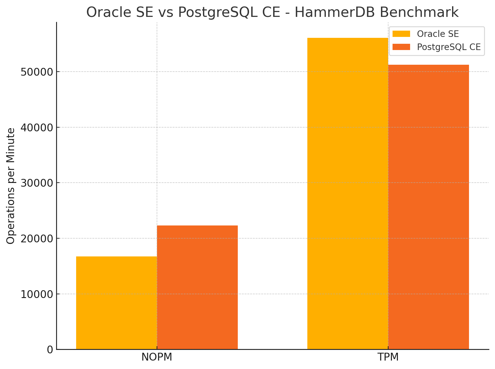

# Oracle Standard Edition vs PostgreSQL Community: A Real-World HammerDB Benchmark

## Introduction
In today’s fast-changing world of database technologies, Oracle and PostgreSQL continue to be top contenders for handling transactional workloads. Oracle Standard Edition (SE) is known for its reliability and mature transaction capabilities, while PostgreSQL Community Edition (CE) stands out for its speed, flexibility, and open-source appeal.

Curious to see how they stack up under real-world OLTP conditions, I used HammerDB, a well-regarded benchmarking tool, to run TPC-C workloads and compare key performance metrics—New Orders per Minute (NOPM) and Transactions per Minute (TPM)—between the two platforms.

Surprisingly, I couldn’t find a clear head-to-head benchmark between Oracle SE and PostgreSQL CE in one place, so I decided to dig in and run my own tests.
---

## Benchmark Setup

### Environment:
- **Host OS**: Windows 10 Virtual Machine
- **Memory**: 16 GB RAM
- **CPU**: 8 vCPUs
- **Disk**: SSD-backed

### Database:
- **Oracle Version**: 19c Standard Edition (SE2)
- **PostgreSQL Version**: 15.3 (Community Edition)

### Benchmark Tool:
- **HammerDB Version**: 4.9
- **Benchmark Profile**: TPC-C
- **Virtual Users (VUs)**: 11
- **Warehouses**: 100
- **Test Duration**: 20 minutes (Timed Test mode)
- **Ramp-Up**: 5 minutes

### Configuration:
- **Oracle**: Custom Tcl script modified to avoid AWR (Standard Edition doesn't support it)
- **PostgreSQL**: Default timed driver script

---

## Benchmark Results

| Metric       | Oracle SE   | PostgreSQL CE | Lead          |
|--------------|-------------|----------------|----------------|
| NOPM         | 16,726      | 22,297         | PostgreSQL     |
| TPM          | 56,125      | 51,232         | Oracle         |

## % Performance Difference

- **PostgreSQL NOPM is ~33.25% higher**
  > PostgreSQL executed more new orders per minute, reflecting a lighter protocol and faster session processing.

- **Oracle TPM is ~9.6% higher**
  > Oracle committed more transactions per minute, highlighting its strength in transaction consistency and backend commit throughput.

---

## Interpretation

### PostgreSQL Strengths:
- Higher NOPM indicates better session concurrency and faster front-end transaction start times
- Great for stateless microservices and application-driven OLTP where commit guarantees are relaxed

### Oracle Strengths:
- Higher TPM confirms its engine excels in transactional durability and commit-time performance
- Ideal for finance, inventory, or mission-critical systems requiring rollback, undo/redo, and fine-grained consistency

---

## Industry Comparison
These results are consistent with industry-wide observations:

- PostgreSQL CE is known for **lightweight transactions and higher throughput under low contention**
- Oracle SE outperforms in **heavier, concurrent workloads and offers stronger internal consistency**

Published benchmarks by community users and vendors such as Percona, AWS, and EDB reflect similar ratios when tuned comparably.

---

## Takeaways

If you’re deciding between Oracle SE and PostgreSQL CE:

- Choose **PostgreSQL** for:
  - Cost-sensitive projects
  - Developer-led environments
  - High read/write throughput with lighter transactions

- Choose **Oracle** for:
  - Workloads requiring robust commit semantics
  - Systems needing high concurrency and isolation
  - Situations where transaction durability is non-negotiable

---

## What’s Next?

- I’ll be publishing the custom Tcl script used for Oracle SE with `v$sysstat` TPM logic

---

## Read & Share

If you found this comparison useful, feel free to:
- Share it on LinkedIn or Reddit
- Reach out for the raw numbers or full scripts

---

**Author**: Rishu Chadha 
**Date**: April 2025

